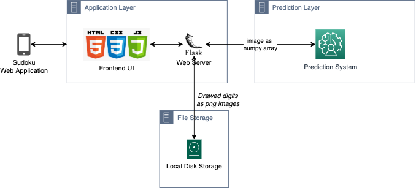

# DS Pergola - Sudoku with Handwritten Digit Recognition (Trained with MNIST data)

### 1. Project Scope

Developing a Sudoku app, which allows users to enter numbers by drawing on screen. 
Drawed canvas will be classified as digits (1 to 9) by a Machine Learning algorithm(?).

### 2. Components
#### 2.1 Application
Application runs on a Flask Server (python) and UI is developed with HTML, CSS and JavaScript.
Sudoku logic is built in the JS layer.
#### 2.2 Model
Model
#### 2.3 Training
Training
#### 2.4 Data Storage
Drawed images are currently stored under digits/ directory with a timestamp name in png format.
Each prediction will be stored into a database.

### 3. Architecture

Diagram drawed in [Draw.io](https://github.com/jgraph/drawio-desktop/releases/tag/v13.5.1)
